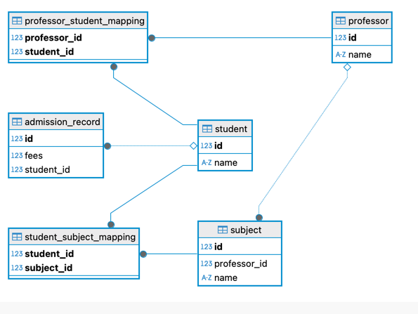

### 📘 **Project**

**College Management System** — Provides API implementation to manage core academic entities.

---

### 🧪 **Environment**

* **IDE**: IntelliJ IDEA 2025.1 (Community Edition)
* **Java Version**: 21
* **MySql Version**: 9.3.0 for macos15.2 on arm64 (Homebrew)

---

### ✅ **Requirements**

1. **Entity Definitions**

    * **Professor**

        * One-to-many relationship with `Subject`
        * Many-to-many relationship with `Student`
    * **Student**

        * One-to-one relationship with `AdmissionRecord`
        * Many-to-many relationship with `Subject`
    * **Subject**

        * Many-to-one relationship with `Professor`
        * Many-to-many relationship with `Student`
    * **AdmissionRecord**

        * One-to-one relationship with `Student`

2. **Database Design**

    * Design relational database schema covering all entity relationships with appropriate foreign keys and join tables (especially for many-to-many).

3. **REST API**

    * Implement CRUD operations for all entities.
    * Use **Spring MVC architecture** to structure the application.

---

### ✅ **Database Diagram**

## Reference links

- https://docs.spring.io/spring-boot/reference/actuator/endpoints.html (Actuator official documentation.)
- https://springdoc.org/#google_vignette (Swagger & Open api)
- https://stackoverflow.com/questions/27799419/maven-jacoco-configuration-exclude-classes-packages-from-report-not-working (
  Jacoco custom configuration)
- https://mbahardogan.medium.com/the-integration-test-with-spring-boot-4893d8151278 (Integration tests)
- https://www.baeldung.com/jacoco-report-exclude (Exclude classes form code the coverage)
